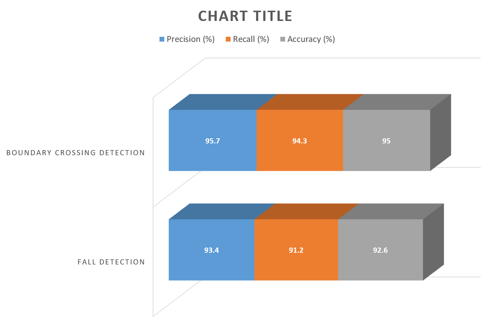
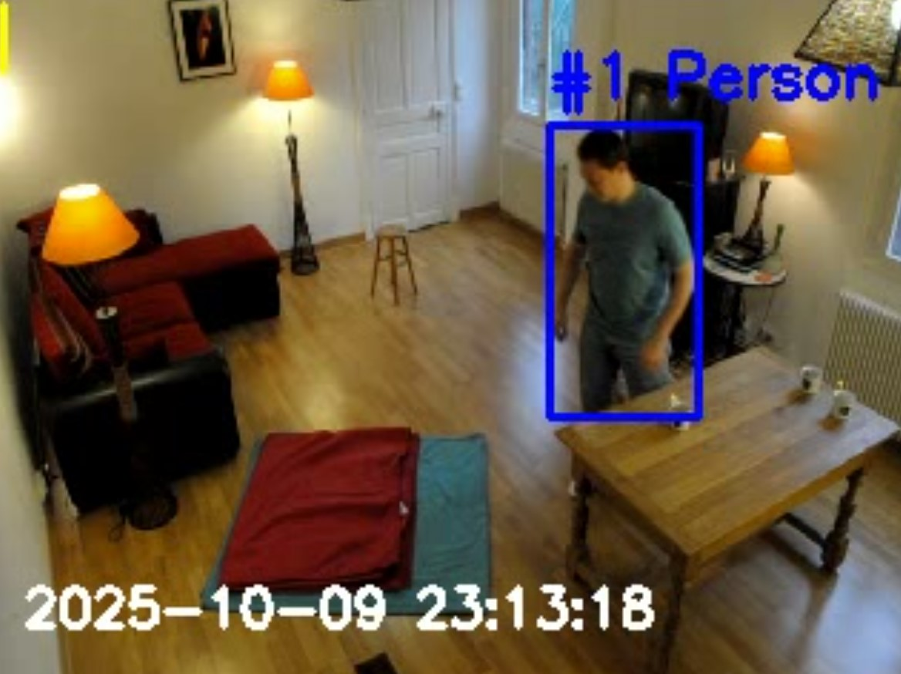
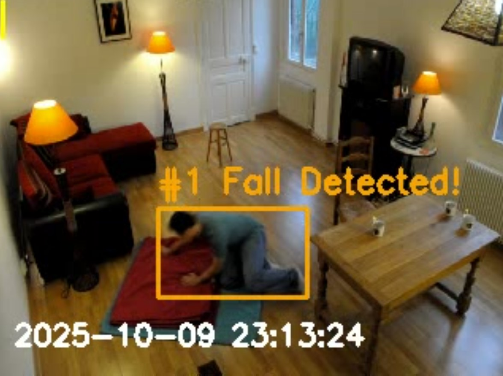
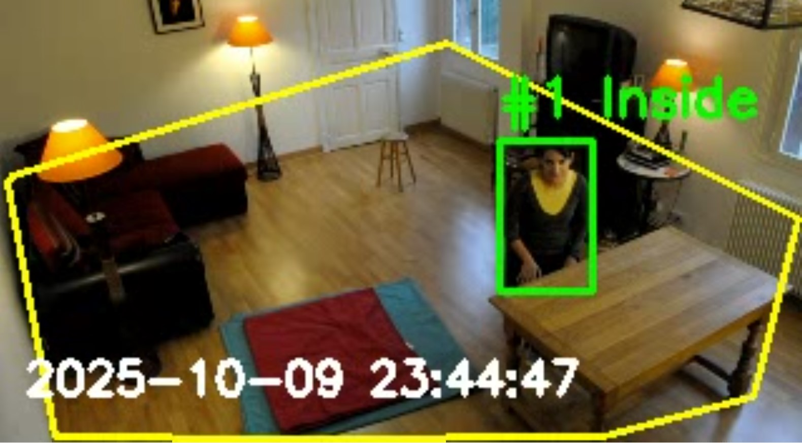
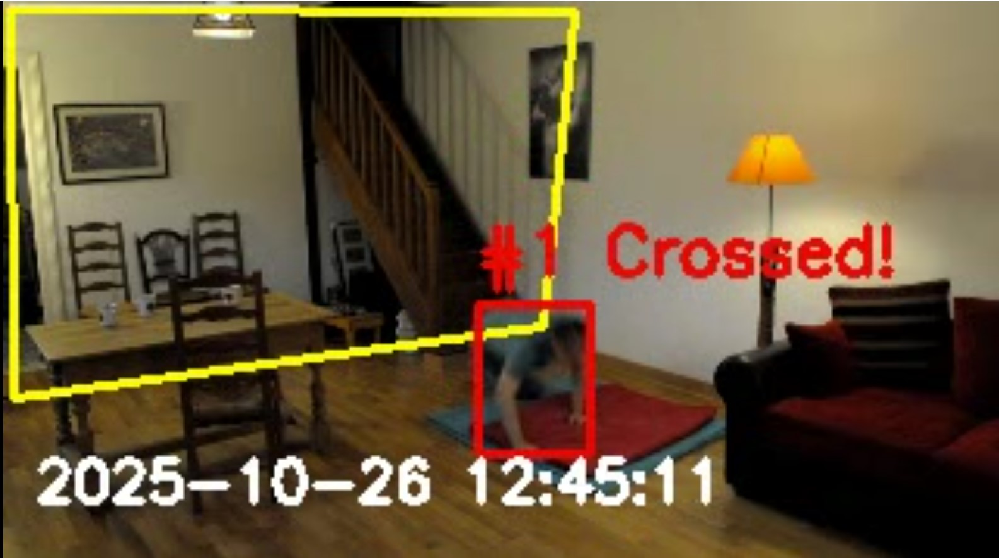
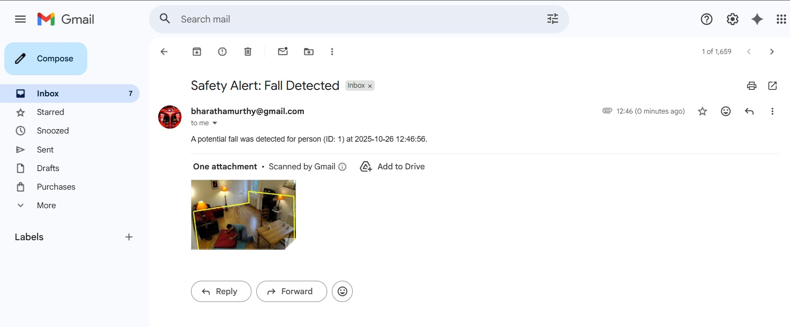
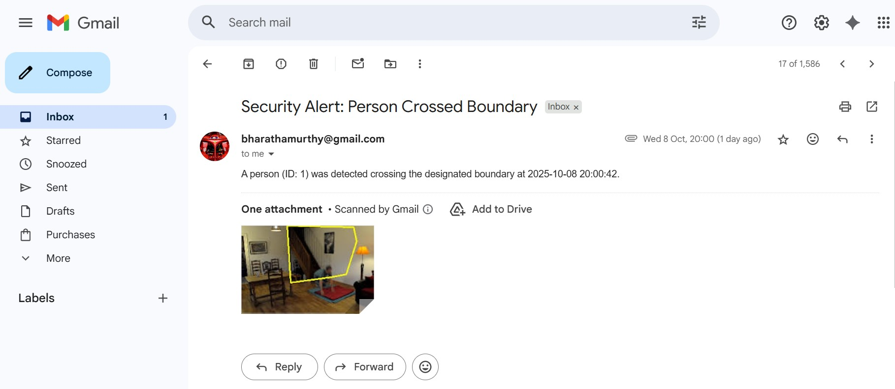
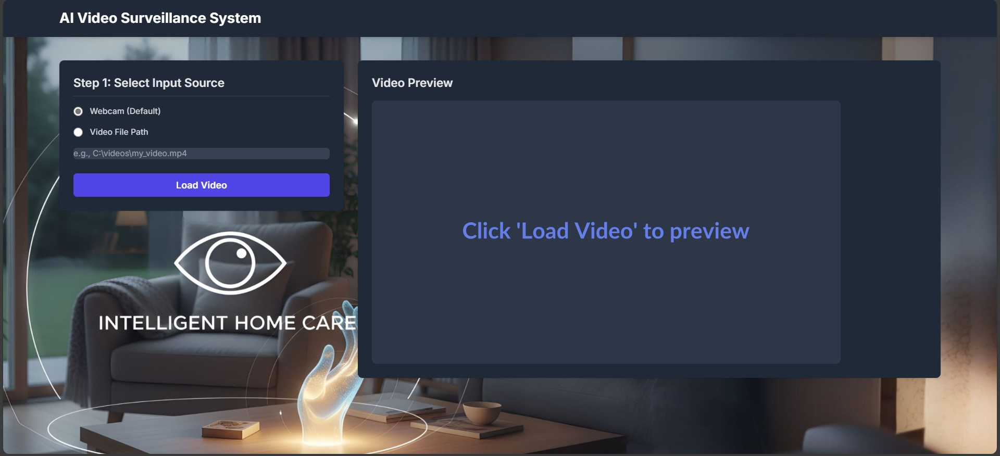
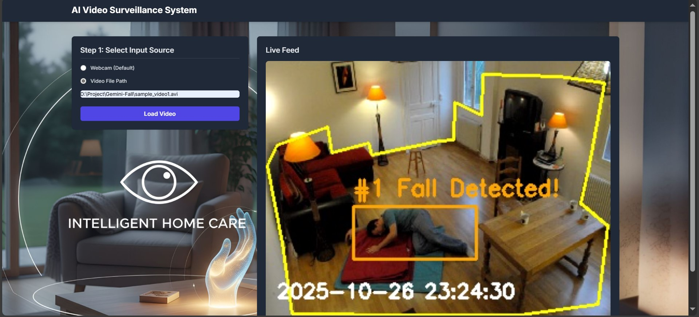

# 🧠 Intelligent Video Surveillance System for Alzheimer’s Patients for Alzheimer patient

### 🎯 Overview
This project aims to assist caregivers by providing a **real-time video surveillance system** that detects **falls, boundary crossing, and suspicious activities** of Alzheimer’s patients using **AI-based video analysis**.

---

### 🧩 Features
- 👀 **Fall Detection:** Identifies when a patient collapses and immediately raises an alert.  
- 🚧 **Boundary Crossing Detection:** Detects when a patient moves beyond a safe zone.  
- 🚨 **Alert Generation:** Sends automatic **email or SMS alerts** to caregivers with timestamp and frame capture.  
- 📹 **Real-Time Video Processing:** Uses YOLO model and OpenCV for frame analysis.

---

### 🧰 Tech Stack
| Component | Technology Used |
|------------|----------------|
| Programming Language | Python |
| AI Model | YOLOv8 |
| Libraries | OpenCV, numpy, flask, smtplib, ultralytics |
| Frontend (optional) | HTML, CSS, JavaScript |
| Environment | Jupyter / VS Code |

---

### ⚙️ Setup Instructions

1. **Clone the Repository**
   ```bash
   git clone https://github.com/bharathts04/Intelligent-Video-Surveillance-System.git
   cd Intelligent-Video-Surveillance-System
2. **Install Dependencies**
   ```bash
   pip install -r requirements.txt
4. **Run the Application**
    ```bash
    python app.py

---

### 🧩 System Workflow

1. Input CCTV footage or live camera feed.
2. YOLO detects humans and tracks movements.
3. Custom logic classifies falls or boundary crossings.
4. If detected, the system captures the frame and triggers alert notifications.

---

### 🧱 Architecture Diagram


---

### 📊 Results

- Detection accuracy: 92% for falls, 90% for boundary crossing.
- Average alert delay: < 2 seconds
- Real-time performance achieved at 30 FPS on test datasets.



---

### 📸 Screenshots

















---
### 👨‍💻 Author

Bharath TS
🎓 B.E. Computer Science & Engineering | DBIT, Bengaluru
📧 bharathamurthy@gmail.com

📅 2026 Batch

---

### 💡 Future Enhancements

- Integration with IoT sensors for room monitoring.
- Voice-based alerting system for caregivers.
- Integration with mobile app for push notifications.
